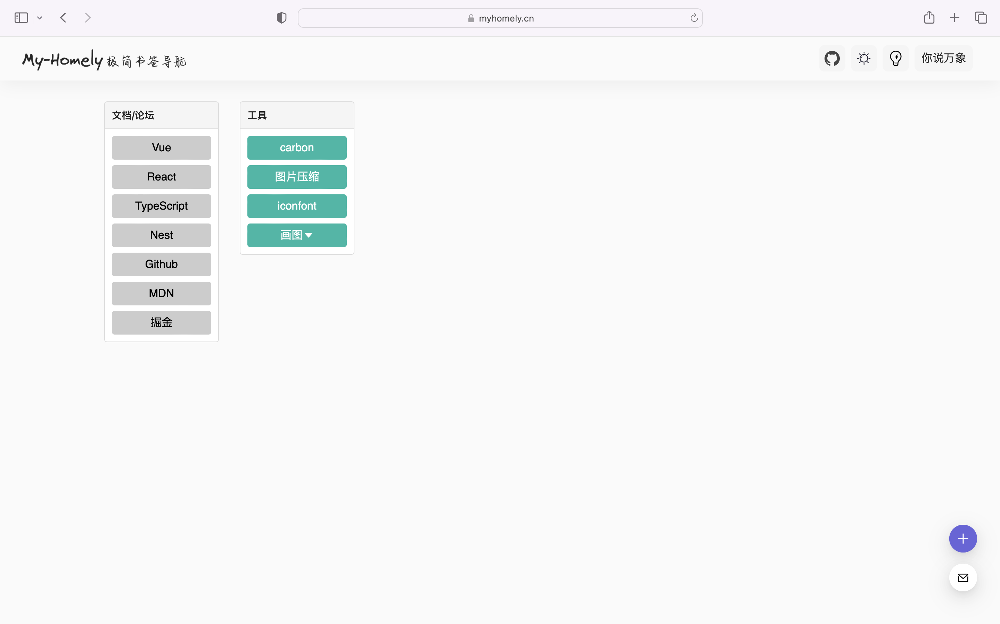

# myhomely
我的导航书签前端仓库

## 项目开发

该项目使用 `Vue3` + `Vite` 进行开发。

```sh
# 1. 克隆项目至本地
git clone https://github.com/honorsuper/myHomely

# 2. 安装项目依赖
pnpm i

# 3. 运行项目
pnpm run dev
```
最后,打开你的浏览器访问服务的地址 http://serverIP:5173 即可


## 服务端
```sh
# 1. 克隆项目至本地
git clone https://github.com/honorsuper/myHomely-service

# 2. 安装项目依赖
yarn

# 3. 运行项目
yarn dev
```


## 产品展示图




## 鸣谢

> [IntelliJ IDEA](https://zh.wikipedia.org/zh-hans/IntelliJ_IDEA) 是一个在各个方面都最大程度地提高开发人员的生产力的 IDE，适用于 JVM 平台语言。

特别感谢 [JetBrains](https://www.jetbrains.com/?from=campus) 为开源项目提供免费的 [IntelliJ IDEA](https://www.jetbrains.com/idea/?from=campus) 等 IDE 的授权    
[](https://www.jetbrains.com/?from=campus)


